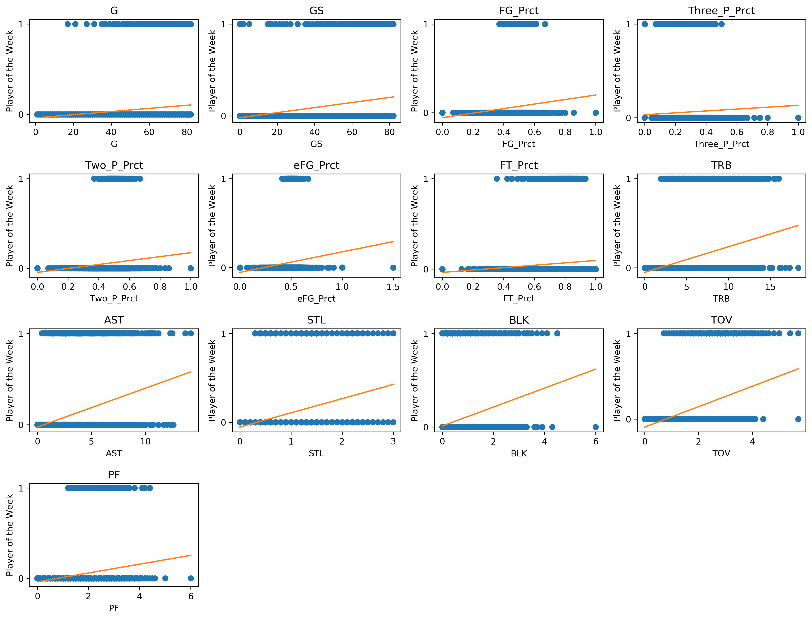
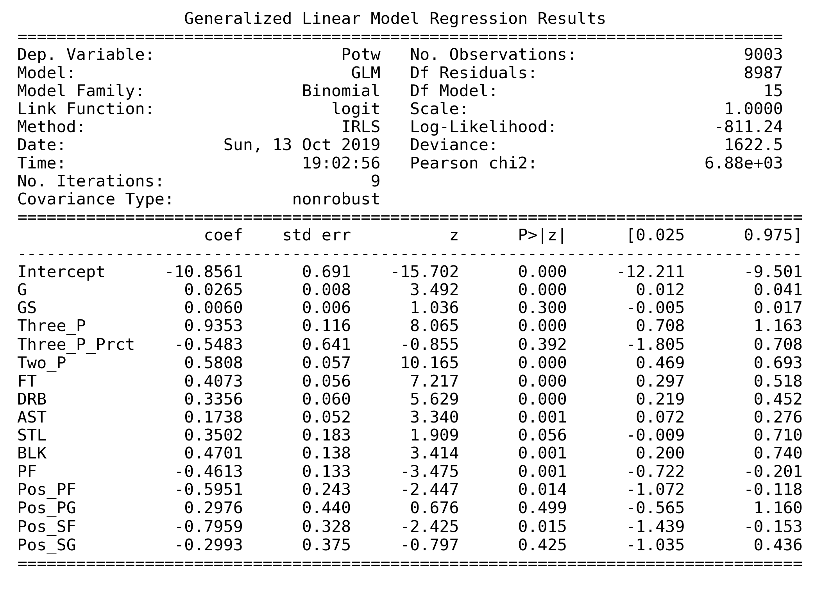
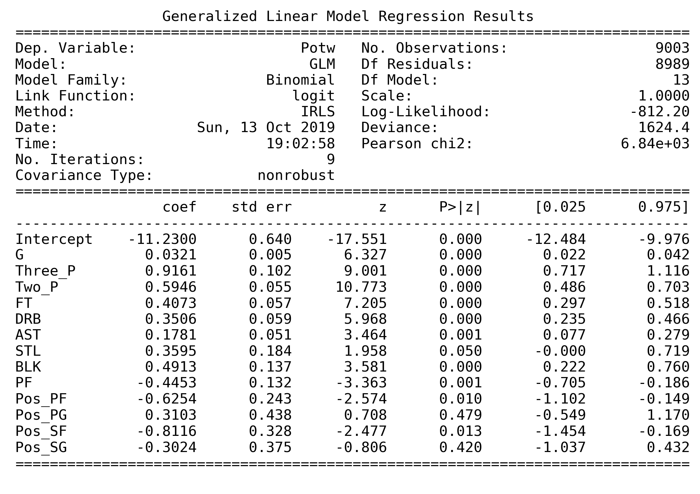
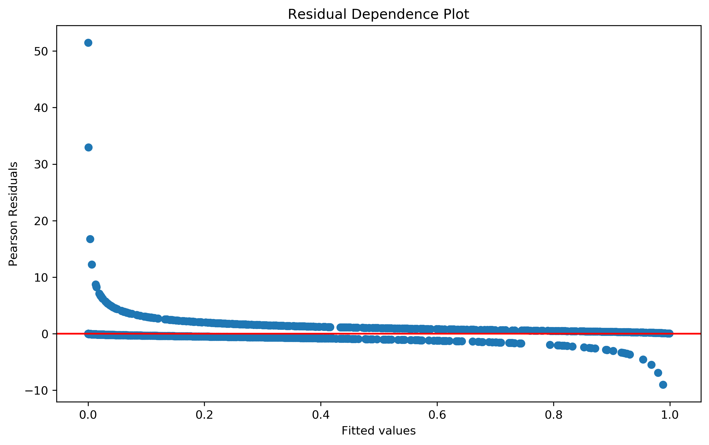
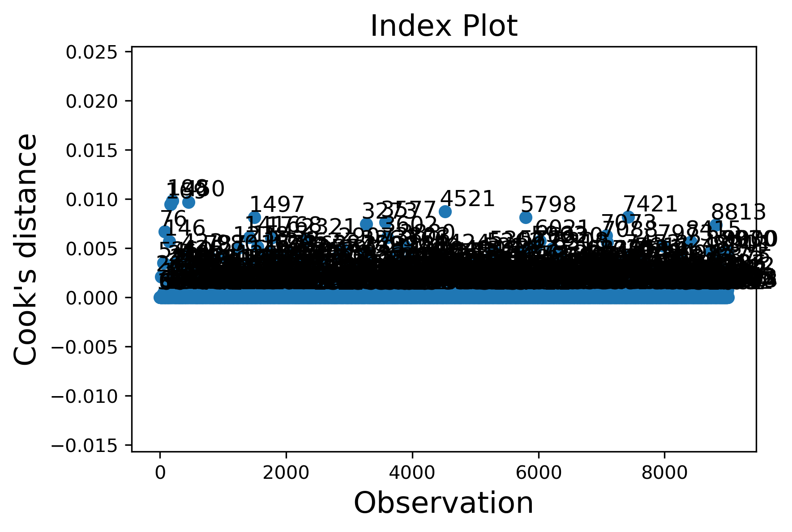
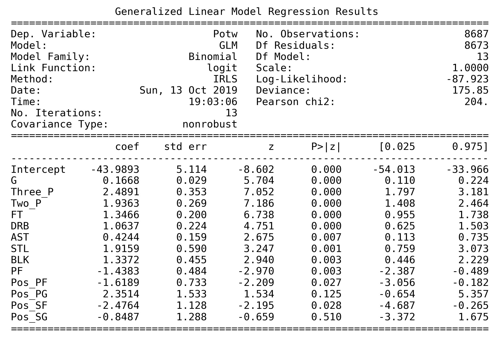
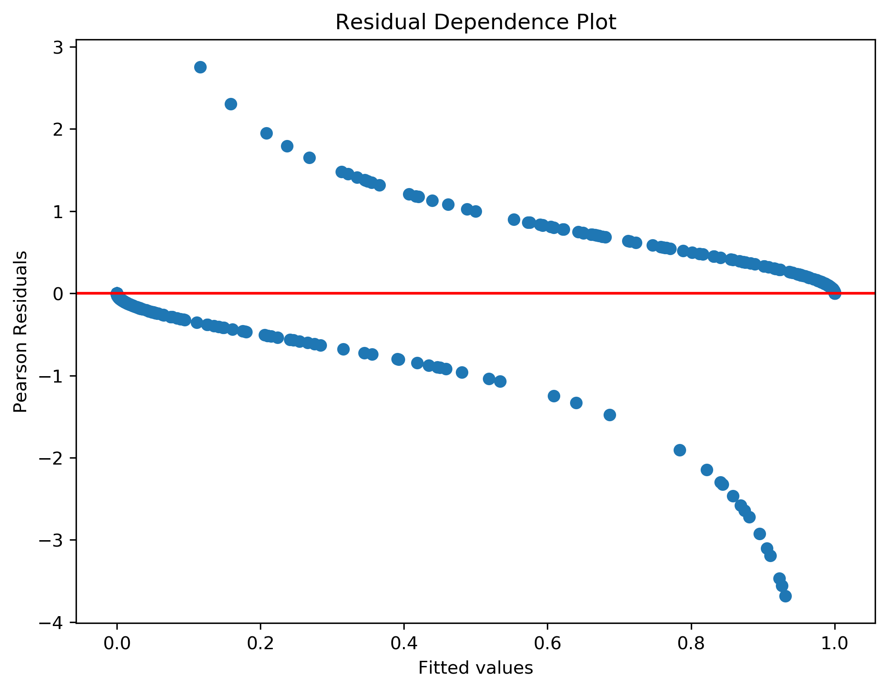
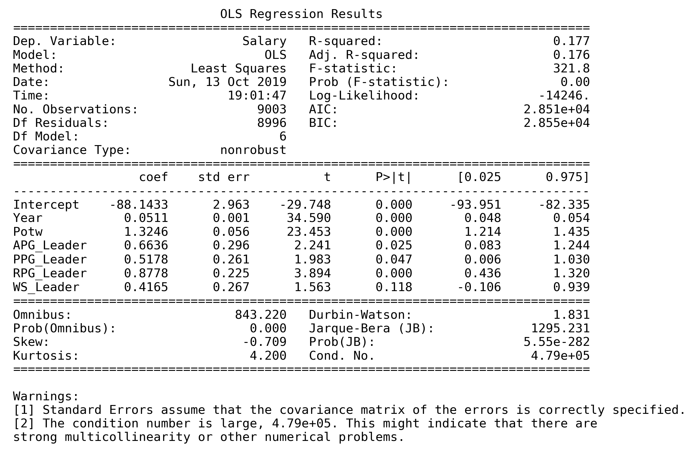
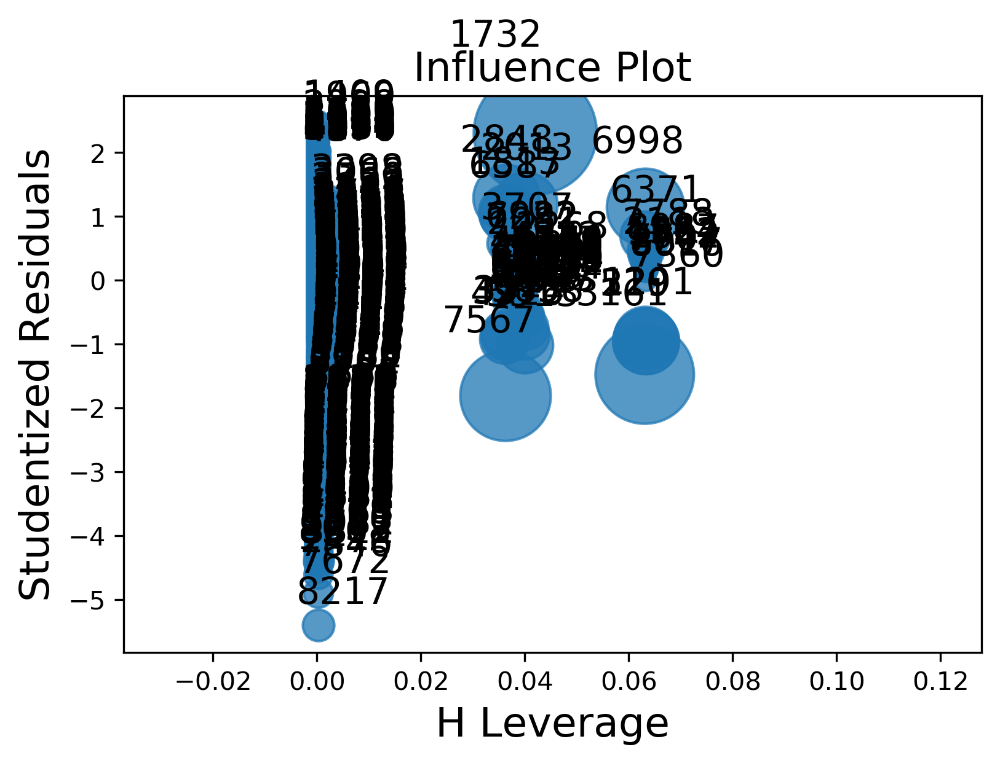
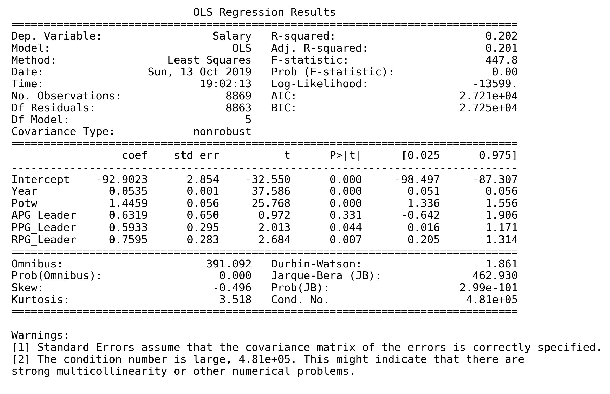

## USF MSDS 601: Linear Regression Analysis
Project: NBA Player of the Week

###### Team Members
* Shirley Li ([@Shirleyiscool](https://github.com/Shirleyiscool))
* Charles Siu ([@chunheisiu](https://github.com/chunheisiu))

### Description of Dataset
Our dataset is a combination of the following datasets with regards to NBA:

- NBA Player of the Week (1985 - 2019)  
https://www.kaggle.com/jacobbaruch/nba-player-of-the-week  
1,187 Rows, 14 Columns

- NBA Player Salary from basketball-reference.com (1991 - 2017)  
https://www.kaggle.com/whitefero/nba-player-salary-19902017  
11,837 Rows, 7 Columns

- NBA Player Salary from basketball-reference.com (2018 - 2019)  
https://web.archive.org/web/20181002194236/www.basketball-reference.com/contracts/players.html  
578 Rows, 11 Columns

- NBA Player Statistics (1985 - 2019)  
https://www.basketball-reference.com/leagues/  
18,480 Rows, 30 Columns

- NBA Yearly Summary (1985 - 2019)  
https://www.basketball-reference.com/leagues/  
35 Rows, 8 Columns

Combining the aforementioned datasets, we created a dataset in which, each row is an NBA player per season, and each column is a statistic of the player. We filtered the rows so that only the players who have both statistics and salary data for that particular season are included.

There are 9,003 Rows and 38 Columns in the dataset.

#### Index of the Dataset
| Variable | Definition | Type |
|---|---|---|
| `Year` | (e.g. `1991` means the NBA 1990 - 1991 Season) | Numerical |
| `Player` | Player name | Categorical |

#### Variables of the Dataset
| Variable | Definition | Type |
|---|---|---|
| `Pos` | Player Position | Categorical |
| `Age` | Age of Player at the start of February 1st of that season | Numerical |
| `Tm` | Team of Player | Categorical |
| `G` | Number of games played | Numerical |
| `GS` | Number of games played when the game started | Numerical |
| `MP` | Minutes played per game | Numerical |
| `FG` | Field Goals per game | Numerical |
| `FGA` | Field Goal attempts per game | Numerical |
| `FG_Prct` | Field Goal percentage | Numerical |
| `Three_P` | 3-Point Field Goals per game | Numerical |
| `Three_PA` | 3-Point Field Goal attempts per game | Numerical |
| `Three_P_Prct` | 3-Point Field Goal percentage | Numerical |
| `Two_P` | 2-Point Field Goals per game | Numerical |
| `Two_PA` | 2-Point Field Goal attempts per game | Numerical |
| `Two_P_Prct` | 2-Point Field Goal percentage | Numerical |
| `ePF_Prct` | Effective Field Goal percentage | Numerical |
| `FT` | Free Throws per game | Numerical |
| `FTA` | Free Throw attempts per game | Numerical |
| `FTA_Prct` | Free Throw percentage | Numerical |
| `ORB` | Offensive Rebounds per game | Numerical |
| `DRB` | Defensive Rebounds per game | Numerical |
| `TRB` | Total Rebounds per game | Numerical |
| `AST` | Assists per game | Numerical |
| `STL` | Steals per game | Numerical |
| `BLK` | Blocks per game | Numerical |
| `TOV` | Turnovers per game | Numerical |
| `PF` | Personal Fouls per game | Numerical |
| `PTS` | Points per game | Numerical |
| `Potw` | Was the player named _Player of the Week_ during the season? | Binary |
| `APG_Leader` | Was the player named _Assists Per Game Leader_ during the season? | Binary |
| `MVP` | Was the player named _Most Valuable Player_ during the season? | Binary |
| `PPG_Leader` | Was the player named _Points Per Game Leader_ during the season? | Binary |
| `RPG_Leader` | Was the player named _Rebounds Per Game Leader_ during the season? | Binary |
| `Rookie` | Was the player named _Rookie of the Year_ during the season? | Binary |
| `WS Leader` | Was the player named _Win Shares Leader_ during the season? | Binary |
| `Salary` | Player Salary | Numerical |

### Statement of Research Problems and Methods
Using the dataset, we stemmed two main research problems:
- **What player statistic contributes the most to the event that the player is named Player of the Week?**  
Since whether a player is named Player of the Week is a binary variable, we decided to approach this problem using the logistic regression model.

- **What NBA title, including Player of the Week, has the most weight on the salary of the player?**  
Since the salary of a player is a numerical variable, we decided to approach this problem using the multiple linear regression model.

For both problems, model selection was performed to find the optimal model, and model diagnosis was performed to mitigate the possible issues of heteroscedasticity, multicollinearity and autocorrelation.

### Problem 1: Relationship between Player Statistics and Player of the Week

#### Explanatory Analysis

After extracting the relevant player statistics and Player of the Week from the dataset, we plotted the relationship between the statistics and Player of the Week using a scatter plot.

Observing the scatter plot, since `Potw` is a binary variable, the scatter plot did not give us a lot of useful information, apart from the differences in range of statistic values between the `Potw = 0` and `Potw = 1`. For every statistic, the range of values seems to be smaller for `Potw = 1`, with the most significant variable being `eFG_Prct`.

This discrepancy in range is also evident in the difference in frequency between `Potw = 0` and `Potw = 1`.

|   Potw |   Count |      Prct |
|-------:|--------:|:---------:|
|      0 |    8505 | 0.944685  |
|      1 |     498 | 0.0553149 |

The frequency table shows that `Potw = 0` accounts for 94% of the data, which is to be expected since the number of players receiving an award would always be significantly smaller than those who did not. However, we are not sure if this would effect the reliability of the models we would build in regression analysis.

We also plotted the correlation using a heatmap.

Observing the heatmap, there are evidence that multicollinearity might exist. For example, The most correlated variables are `Two_P_Prct` and `FG_Prct`, but this is to be expected since `FG_Prct` is derived from `Two_P_Prct`. Similarly, `eFG_Prct` is derived from `FG_Prct`, so the correlation is high between them. Hence, some of these variables, specifically those that have direct relationships, will need to be removed prior to regression analysis.

Meanwhile, `TOV`, `AST` and `STL` are highly correlated between one another. However, turnovers, assists and steals are basketball moves often performed by point guards, so there might be indirect relationships between these variables. Nonetheless, these correlations would need to be addressed in regression analysis.

#### Regression Analysis

#### Model Selection

- As `Pos` is categorical variables, we first get dummies for this predictors.
- Since some statistics are calculated by other statistics, there would be strong multicollinearity if we include all of them. Therefore, we drop these following statistics for our first model.

    `TRB` = `ORB` + `DRB`   
    `FGA` = `FG` * `FG_Prct`   
    `Three_PA` = `Three_P` * `Three_P_Prct`   
    `Two_PA` = `Two_P` * `Two_P_Prct`   
    `FTA` = `FT_P` * `FT_Prct`  
    `PTS` = `Three_P` + `Two_P` + `FT_P`  
    `FG` = `Three_P` + `Two_P`   

- Then we fit the full model using all the remaining players' statistics, such as `Age`,`G`,`GS`,`MP`and etc.. Hence, we got the following logistic regression model as follows.

##### Full Model Summary - Model 1

Given that there are too many variables with high correlation from the heatmap above as well as the there is warnning on multicollinearity, we decided to first use both VIF Factors and Deviance Test to find removable predictors.

##### VIF analysis on full model

| Features     |   VIF Factor |
|:-------------|:------------:|
| Age          |     23.7475  |
| G            |     11.2644  |
| GS           |      6.57655 |
| MP           |     79.4739  |
| FG_Prct      |    870.907   |
| Three_P      |      8.40503 |
| Three_P_Prct |      6.21584 |
| Two_P        |     22.851   |
| Two_P_Prct   |    122.755   |
| eFG_Prct     |    755.823   |
| FT           |     10.2741  |
| FT_Prct      |     21.833   |
| ORB          |     11.5458  |
| DRB          |     18.2727  |
| AST          |     12.1883  |
| STL          |     10.1388  |
| BLK          |      3.92813 |
| TOV          |     23.6123  |
| PF           |     20.7312  |
| Pos_PF       |      2.29591 |
| Pos_PG       |      4.82529 |
| Pos_SF       |      3.03752 |
| Pos_SG       |      3.895   |

Using a function to remove a predictor with max VIF for each VIF test while deleting that predictor would not reject H0 in deviance test and thus choose reduced model.

Hence, we remove predictors `FG_Prct`, `eFG_Prct`, `TOV`, `Age`, `MP`, `FT_Prct`, `Two_P_Prct`, `ORB`, which both have high VIF factors and the reduced model with low ΔG in a Deviance Test.

With these remaining predictors, we run a logistic model again and here is our second model.

##### Reduced Model Summary - Model 2

| Features     |   VIF Factor |
|:-------------|:------------:|
| Two_P        |     16.2202  |
| DRB          |     12.2412  |
| PF           |     12.0968  |
| STL          |      9.59197 |
| G            |      9.12068 |
| FT           |      8.76224 |
| AST          |      8.3415  |
| GS           |      5.37419 |
| Three_P_Prct |      4.76798 |
| BLK          |      3.78012 |
| Pos_PG       |      3.45641 |
| Three_P      |      3.4551  |
| Pos_SG       |      2.54538 |
| Pos_SF       |      2.13738 |
| Pos_PF       |      1.90174 |

But still there are some remaining predictors with VIF Factor larger than 10.

To make sure whether reduced model is better than the full model, we do a deviance test.

Null Hypothesis: Reduced Model   
Alternative Hypothesis: Full Model

 ΔG = ΔG(Reduced Model) - ΔG(Full Model) = 13.7661   
 χ2 = 15.5073

On significant level of 0.05, ΔG > χ2. Therefore, we cannot reject Null Hypothesis and then choose Model 2.

But as Wald test shows that there still seems some insignificant predictors with p-values larger than 0.05. Therefore, we continue to remove predictors using Deviance Test and Wald Test. Here are removable predictors based on Deviance Test.

| Deviance test|    GS   | Three_P_Prct |  Pos_PG  |  Pos_SG  |
|:-------------|:-------:|:------------:|:--------:|:--------:|
| delta_G      | 14.9021 | 14.5091 |14.2247 |14.3993 |
| chi2_stat    | 16.9190 | 16.9190 |16.9190 |16.9190 |

However, we use position as dummies variables. So, if we drop `Pos_PG` and `Pos_SG`, we need to drop other 2 other variables. In this case, dropping too many predictors, Deviance Test would tell us to stick to the full model.

Hence, we only drop variables `GS` and `Three_P_Prct` and keep `Pos` dummies.

##### Reduced Model Summary - Model 3

So far, here is the main logistic model we'll use.

#### Model Diagnosis

##### Multicollinearity

| Features   |   VIF Factor |
|:-----------|:------------:|
| Two_P      |     15.268   |
| DRB        |     12.0013  |
| PF         |     11.9826  |
| STL        |      9.41759 |
| FT         |      8.6996  |
| G          |      8.27271 |
| AST        |      8.09547 |
| BLK        |      3.77999 |
| Pos_PG     |      2.90391 |
| Three_P    |      2.76944 |
| Pos_SG     |      2.12558 |
| Pos_SF     |      1.80177 |
| Pos_PF     |      1.73616 |

The VIF table above indicates that there is multicollinearity problem in this model. But we don't choose to drop those predictors with high VIF as both Deviance test and Wald test consider them as significant. So we choose not to drop these predictors.

##### Pearson residuals Plot -- Test Heteroscedasticity

From the graph above, we can see there are some "studentized residuals" with absolute values larger than 3, which indicates there may be outliers or influential points causing heteroscedasticity.

To find the outliers and influential points, here we plot residuals as well as cook's distance.

##### Internally Studentized Residuals

##### Cook's Distance

Given cook's distance, Diffits and Studentized Residuals,, here we find 316 influential points. Since 316 observations take only about 5% of the total observations. Therefore, we drop these observations and rerun the model.

#### Final Model - Model 4
##### Reduced Model Summary - Model 4

Here is our final model. To confirm that whether it is the best model we have run, we compare AIC and BIC of the above 4 models.

| Model   |  AIC     |      BIC |
|:--------|---------:|:--------:|
| Model 1     | 1656.71  | -80147.9 |
| Model 2     | 1654.48  | -80207   |
| Model 3     | 1652.39  | -80223.3 |
| Model 4     |  203.846 | -78484.6 |

Clearly, before dropping outliers and influential points, Model 3 has the lowest AIC and BIC, showing Model 3 is better than Model 1 and Model 2.
After we drop outliers and influential points, AIC of Model decreases a lot while BIC increases a little bit. So we will choose Model 4 as our final model.

##### Model 4 - Internally Studentized Residuals

After removing outliers, the residual plots seems better.

##### Model 4 - π Plot

Here we visualize how π changes with the model.

#### Final Model Summary
##### Variables
| Type   |     Intercept |       G |   Three_P |   Two_P |      FT |     DRB |      AST |     STL |     BLK |       PF |    Pos_PF |   Pos_PG |     Pos_SF |    Pos_SG |
|:-------|--------------:|--------:|----------:|--------:|--------:|--------:|---------:|--------:|--------:|---------:|----------:|---------:|-----------:|:---------:|
| βi     | -43.9893      | 0.16684 |   2.48911 | 1.93632 | 1.34657 | 1.06373 | 0.424438 | 1.91591 | 1.33724 | -1.4383  | -1.6189   |  2.35139 | -2.47636   | -0.848657 |
| e^(βi) |   7.86469e-20 | 1.18157 |  12.0505  | 6.93322 | 3.84421 | 2.89715 | 1.52873  | 6.79309 | 3.80851 |  0.23733 |  0.198117 | 10.5002  |  0.0840489 |  0.427989 |

##### Formula

##### Interpretation of Model

- `Intercept`: the probability for a player win the award Player of the Week is **7.8647e-20**, which is super small.
- `G` : While controlling other variables, the odds for a player, who plays 1 more game, to win the POTW increase **18%**.
- `Three_P`: While controlling other variables, the odds for a player who can have one more 3-Point Field Goals per game, to win the POTW increase about **11** times.
- `Two_P`: While controlling other variables, the odds for a player, who can have one more 2-point field goals per game, to win the POTW increase about **6** times.
- `FT`: While controlling other variables, the odds for a player, who can have one more free throw per game, to win the POTW increase about **2.8** times.
- `DRB`: While controlling other variables, the odds for a player, who can have one more defensive rebounds per game, to win the POTW increase about **1.9** times.
- `AST`: While controlling other variables, the odds for a player, who can have one more assists per game, to win the POTW increase about **53%**.
- `STL`: While controlling other variables, the odds for a player, who can have one more steals per game, to win the POTW increase about **5.8** times.
- `BLK`: While controlling other variables, the odds for a player, who can have one more blocks per game, to win the POTW increase about **2.8** times.
- `PF`: While controlling other variables, the odds for a player, who can have one more personal fouls per game, to win the POTW decrease about **77%**.
- `Pos_PF`: While controlling other variables, the odds for a power forward is **80%** less than center.
- `Pos_PG`: While controlling other variables, the odds for a points guard is **9.5** times more than center.
- `Pos_SF`: While controlling other variables, the odds for a small forward is **92%** less than center.
- `Pos_SG`: While controlling other variables, the odds for a shooting guard is **57%** less than center.

To summarize, the model indicates that **3-Point Field Goals per game** attach the most importance to decide whether a player could get player of the week. Besides, the chance for a **point guard** to win player of the week is larger than other players. If a player wants to increase his chance of winning player of the week, increasing **2-point field goals per game**, **free throw per game**, **steals**, **assists**, **blocks** and **defensive rebounds** as well as decreasing **personal fouls** would be recommended.

##### Prediction of Model
|   Intercept |   G |   Three_P |   Two_P |   FT |   DRB |   AST |   STL |   BLK |   PF |   Pos_PF |   Pos_PG |   Pos_SF |   Pos_SG |   Predicted πi |
|------------:|----:|----------:|--------:|-----:|------:|------:|------:|------:|-----:|---------:|---------:|---------:|---------:|:--------------:|
|           1 |  56 |       0.9 |     2.1 |    1 |   2.5 |   1.5 |   0.6 |   0.3 |  1.9 |        0 |        0 |        0 |        0 |              0 |
|           1 |  82 |       5.1 |     9.3 |    0 |  11.1 |  10.7 |   2.4 |   2.7 |  3.8 |        0 |        1 |        0 |        0 |              1 |

We use the median statistic of 2019 and max statistic of 2019 to do prediction. As a result, the probability of a player with median performance has 0% chance to win POTW while a player with max performance has 99.99% chance to win POTW. This prediction successfully indicates our model can predict whether a player could win POTW based on his performance to some extent.

### Problem 2: Relationship between NBA Titles and Player Salary

#### Explanatory Analysis
After extracting the relevant player titles and salary from the dataset, we plotted the relationship between the titles and salary using a scatter plot.

Observing the scatter plot, since all of the variables are binary except for `Year`, it is difficult to interpret the relationships using the scatter plot. Looking at the `Year` plot, there is evidently a positive linear relationship between `Year` and `Salary`. What is also interesting about the `Year` graph is that, despite having a positive relationship, the range of values also increased for every season.

This change in range may have been affected by the increase in observations over the years.

|   Decade |   Count |
|---------:|:-------:|
|     1990 |    2416 |
|     2000 |    2998 |
|     2010 |    3589 |

From the frequency table, we can clearly see the increase in observations over the seasons. The cause of this is unknown; either there is a steady increase in players, or there is a steady increase in data collected. Nonetheless, this might be worth looking into and be cautious about during regression analysis.

We also plotted the correlation using a heatmap.

Observing the heatmap, the overall correlation seems pretty low, except for `WS_Leader` and `MVP`. This means that, except for MVP and Win Shares Leader, having one NBA title does not automatically entitled you to another. It also meant that multicollinearity is likely not an issue in regression analysis.

#### Regression Analysis
We first fitted the full model with variables `Year`, `Potw`, `APG_Leader`, `MVP`, `PPG_Leader`, `RPG_Leader`, `Rookie`, `WS_Leader`.

##### Model Summary

##### ANOVA Table
| index      |   df |      sum_sq |     mean_sq |          F |         PR(>F) |
|:-----------|-----:|------------:|------------:|-----------:|:--------------:|
| Year       |    1 | 2.3164e+16  | 2.3164e+16  | 1330.82    |   7.34954e-272 |
| Potw       |    1 | 2.21228e+16 | 2.21228e+16 | 1271       |   1.67026e-260 |
| APG_Leader |    1 | 2.89658e+14 | 2.89658e+14 |   16.6414  |   4.55432e-05  |
| MVP        |    1 | 3.69627e+14 | 3.69627e+14 |   21.2359  |   4.11687e-06  |
| PPG_Leader |    1 | 4.0067e+14  | 4.0067e+14  |   23.0193  |   1.6296e-06   |
| RPG_Leader |    1 | 6.31608e+14 | 6.31608e+14 |   36.2872  |   1.76961e-09  |
| Rookie     |    1 | 8.00524e+13 | 8.00524e+13 |    4.59918 |   0.032014     |
| WS_Leader  |    1 | 6.38674e+13 | 6.38674e+13 |    3.66932 |   0.0554546    |
| Residual   | 8994 | 1.56548e+17 | 1.74058e+13 |  nan       | nan            |

From the model summary and ANOVA table, it is evident that `MVP` and `WS_Leader` are not statistically significant variables based on both t-test and F-test. However, since they are highly correlated, as mentioned above, it is likely that only one of them would need to be remove.

Upon checking for non-linearity of the model, we found signs of non-linearity from the residual plot.

Hence, we performed a log transformation on `Salary` to attempt to correct the problem. We refitted the full model using the log-transformed data.

##### Model Summary

##### ANOVA Table
| index      |   df |       sum_sq |     mean_sq |           F |         PR(>F) |
|:-----------|-----:|-------------:|------------:|------------:|:--------------:|
| Year       |    1 |  1709.68     | 1709.68     | 1231.95     |   4.70618e-253 |
| Potw       |    1 |   926.665    |  926.665    |  667.731    |   4.35078e-142 |
| APG_Leader |    1 |     6.77177  |    6.77177  |    4.87956  |   0.0272016    |
| MVP        |    1 |     5.36321  |    5.36321  |    3.86459  |   0.0493459    |
| PPG_Leader |    1 |     6.68263  |    6.68263  |    4.81533  |   0.0282331    |
| RPG_Leader |    1 |    22.0516   |   22.0516   |   15.8898   |   6.76709e-05  |
| Rookie     |    1 |     0.323805 |    0.323805 |    0.233326 |   0.629081     |
| WS_Leader  |    1 |     1.72901  |    1.72901  |    1.24588  |   0.26437      |
| Residual   | 8994 | 12481.7      |    1.38778  |  nan        | nan            |

From the model summary, the log-transformed data confirmed the statistical insignificance of `MVP`. Meanwhile, the ANOVA table shows that `Rookie` and `WS_Leader` are also statistically insignificant. We kept that in mind for model selection.

The log-transformed data had seemingly reduced the severity of non-linearity.

#### Model Selection
We then proceeded to Model Selection using Adjusted R², Mallow's CP, AIC, and BIC.

##### Best Subset Regression Table
|   index |   Number of Predictors |   Adjusted R-Squared |   Mallows CP | Predictors                                                        |     AIC |     BIC |
|--------:|-----------------------:|---------------------:|-------------:|:------------------------------------------------------------------|--------:|:-------:|
|     225 |                      6 |             0.176143 |      5.31422 | Year, Potw, APG_Leader, PPG_Leader, RPG_Leader, WS_Leader         | 28505.1 | 28554.8 |
|     166 |                      5 |             0.176011 |      5.75517 | Year, Potw, APG_Leader, PPG_Leader, RPG_Leader                    | 28505.5 | 28548.1 |
|     218 |                      6 |             0.176037 |      6.47921 | Year, Potw, APG_Leader, MVP, PPG_Leader, RPG_Leader               | 28506.2 | 28556   |
|     250 |                      7 |             0.176073 |      7.08048 | Year, Potw, APG_Leader, PPG_Leader, RPG_Leader, Rookie, WS_Leader | 28506.8 | 28563.7 |
|     247 |                      7 |             0.176059 |      7.23564 | Year, Potw, APG_Leader, MVP, PPG_Leader, RPG_Leader, WS_Leader    | 28507   | 28563.8 |

From this table, we can see that, the models with 5 and 6 predictors performed relatively similar. They differ in whether `WS_Leader` is included as a variable. It is noted above that `WS_Leader` might be insignificant as shown in the F-test result. We chose to regress both models and compare.

Regressing the model with 6 variables, we got the following results.

##### Model Summary

##### ANOVA Table
| index      |   df |      sum_sq |    mean_sq |          F |         PR(>F) |
|:-----------|-----:|------------:|-----------:|-----------:|:--------------:|
| Year       |    1 |  1709.68    | 1709.68    | 1232.18    |   4.21791e-253 |
| Potw       |    1 |   926.665   |  926.665   |  667.856   |   4.09393e-142 |
| APG_Leader |    1 |     6.77177 |    6.77177 |    4.88048 |   0.0271872    |
| PPG_Leader |    1 |    10.0137  |   10.0137  |    7.21698 |   0.00723497   |
| RPG_Leader |    1 |    22.3129  |   22.3129  |   16.0811  |   6.11763e-05  |
| WS_Leader  |    1 |     3.38751 |    3.38751 |    2.44141 |   0.118205     |
| Residual   | 8996 | 12482.1     |    1.38752 |  nan       | nan            |

Regressing the model with 5 variables, we got the following results.

##### Model Summary

##### ANOVA Table
| index      |   df |      sum_sq |    mean_sq |          F |         PR(>F) |
|:-----------|-----:|------------:|-----------:|-----------:|:--------------:|
| Year       |    1 |  1709.68    | 1709.68    | 1231.98    |   4.58256e-253 |
| Potw       |    1 |   926.665   |  926.665   |  667.749   |   4.29787e-142 |
| APG_Leader |    1 |     6.77177 |    6.77177 |    4.8797  |   0.0271995    |
| PPG_Leader |    1 |    10.0137  |   10.0137  |    7.21582 |   0.00723963   |
| RPG_Leader |    1 |    22.3129  |   22.3129  |   16.0786  |   6.12594e-05  |
| Residual   | 8997 | 12485.5     |    1.38774 |  nan       | nan            |

It is clear that the model `Salary` ~ `Year` + `Potw` + `APG_Leader` + `PPG_Leader` + `RPG_Leader` performed better without `WS_Leader`, as shown in t-test and F-test results in the model summary and ANOVA table.

#### Model Diagnosis
We first checked whether influential points exist in the model.

From the influence plot, it is evident that some of the observations are influential. After calculating the Cook's Distance for each observation, we found that 134 observations are influential under the `4 / n - p` heuristic threshold, which is 1.49% of the data. We attempted remove these outliers and refit the model.

##### Model Summary

##### ANOVA Table
| index      |   df |      sum_sq |    mean_sq |           F |         PR(>F) |
|:-----------|-----:|------------:|-----------:|------------:|:--------------:|
| Year       |    1 |  1866.2     | 1866.2     | 1483.66     |   2.92382e-300 |
| Potw       |    1 |   935.444   |  935.444   |  743.696    |   2.5721e-157  |
| APG_Leader |    1 |     1.04749 |    1.04749 |    0.832772 |   0.361497     |
| PPG_Leader |    1 |     4.77119 |    4.77119 |    3.79319  |   0.051493     |
| RPG_Leader |    1 |     9.06309 |    9.06309 |    7.20534  |   0.00728222   |
| Residual   | 8863 | 11148.1     |    1.25783 |  nan        | nan            |

Observing the model summary and the ANOVA table, it seems that `APG_Leader` and `PPG_Leader` were rendered statistically insignificant after the removal of outliers. We don't believe that dropping more variables is the right approach, so we kept the outliers in the final mode and proceeded.

We then checked for heteroscedasticity using the Breusch-Pagan test.

##### Breusch-Pagan Test Results
|   LM Statistic |   LM-Test p-value |   F-Statistic |   F-Test p-value |
|---------------:|------------------:|--------------:|:----------------:|
|         131.12 |        1.3766e-26 |       26.5939 |      8.87478e-27 |

From the p-values of LM-test and F-test in the Breusch-Pagan test, we determined that, it is unlikely that the model suffers from heteroscedasticity.

We then checked for multicollinearity using both the Breusch-Godfrey test and VIF.

##### Breusch-Godfrey Results
|   LM Statistic |   LM-Test p-value |   F-Statistic |   F-Test p-value |
|---------------:|------------------:|--------------:|:----------------:|
|        209.138 |       2.76112e-26 |       5.91981 |      1.25427e-26 |

##### VIF Test Results
| Features   |   VIF Factor |
|:-----------|:------------:|
| Year       |      1.0598  |
| Potw       |      1.12948 |
| APG_Leader |      1.00912 |
| PPG_Leader |      1.04567 |
| RPG_Leader |      1.02037 |

From the p-values of LM-test and F-test in the Breusch-Godfrey test, as well as the VIF factors from the VIF test result, we determined that, it is unlikely that the model suffers from multicollinearity.

We finally checked for non-normality using QQ plot.

From the QQ plot, we determined that, it is unlikely that the model suffers from non-normality.

#### Final Model Summary
##### Variables
| Type   |     Intercept |      Year |    Potw |   APG_Leader |   PPG_Leader |   RPG_Leader |
|:-------|--------------:|----------:|--------:|-------------:|-------------:|:------------:|
| βi     | -88.1045      | 0.0510719 | 1.33466 |     0.684587 |     0.675161 |     0.901754 |
| e^(βi) |   5.45361e-39 | 1.0524    | 3.79872 |     1.98295  |     1.96435  |     2.46392  |

##### Formula

##### Interpretation of Model

- `Year`: Regardless the award, a player would tend to earn **5.24%** more salary than last year.
- `Potw`: If a player is a Player of the Week (POTW), he would tend to earn **2.8** times more than non-POTW.
- `APG Leader`: If a player is an Assists Per Game Leader (APG Leader), he would tend to earn **98.3%** more than non-APG_Leader.
- `PPG Leader`: If a player is a Points Per Game Leader (PPG Leader), he would tend to earn **96.44%** more than non-PPG_Leader.
- `RPG Leader`: If a player is a Points Per Game Leader (RPG Leader), he would tend to earn **1.46** times more than non-RPG_Leader.

To summarize, the model indicates that NBA player's salary will naturally increase each year by 5.24%. If an NBA player can earn an award such as POTW, APG Leader, PPG Leader, or RPG Leader, his salary would significantly higher than those who don't receive awards. Within these awards, **POTW** mostly reflect a player's value since POTW earns most. Besides, **RPG Leader** also earns much maybe because these players can make use of their body to play basketball and thus their advantage is stable and hard to be replaced by other guys. Therefore, their salaries tend to be higher.

##### Prediction of Model
|   Intercept |    Year |   Potw |   APG_Leader |   PPG_Leader |   RPG_Leader |   Predicted Salary |
|------------:|--------:|-------:|-------------:|-------------:|-------------:|:------------------:|
|        1.00 | 2020.00 |   0.00 |         0.00 |         0.00 |         0.00 |         3473656.83 |
|        1.00 | 2020.00 |   1.00 |         0.00 |         0.00 |         0.00 |        13195447.58 |
|        1.00 | 2020.00 |   1.00 |         0.00 |         1.00 |         0.00 |        25920463.52 |

We predict three situations based on this model.
- Predict in year 2020 a player's salary when he doesn't have any awards.
- Predict in year 2020 a player's salary when he only wins POTW.
- Predict in year 2020 a player's salary when he wins POTW as well as PPG Leader.

The result shows that the average salary for NBA player is about 3.47 millions if he doesn't win any awards. However, if a player wins at least one time POTW, it means it's predicted salary could be 13.2 millions, which is a lot more higher than non_POTW. What's more, PPG Leader could also indicate a player's higher salary.

### Summary

The first model shows us how player's performance can predict whether a player could win POTW. Despite unfixable multicollinearity, this logistic model is fitted with many important predictors such as 3-points field goals and 2 points field goals, quantitatively giving us a way to predict the chance of a player to get POTW based on his statistics.

The second model fits well and indicate the relationship between player's awards and his salaries. Unexpectedly, NBA player's salary would be higher if he could win POTW, PPG Leader, RPG Leader and so on. However, MVP and WS Leader seems not so significant and thus are excluded in the model. We assume that it might be due to time lag and awards might better reflect next year's salary. This is what we could improve for the further research.
