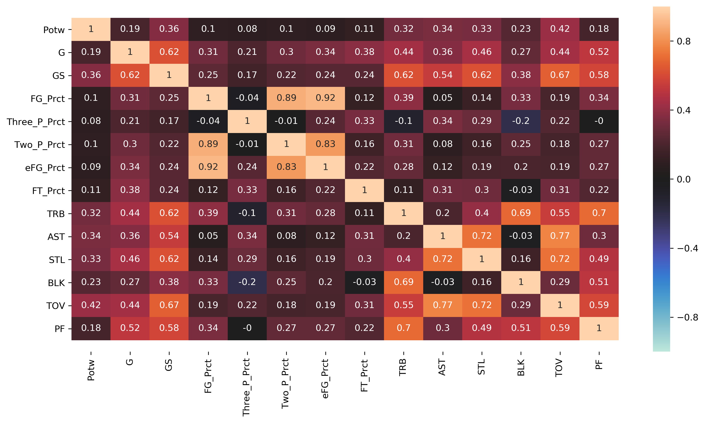
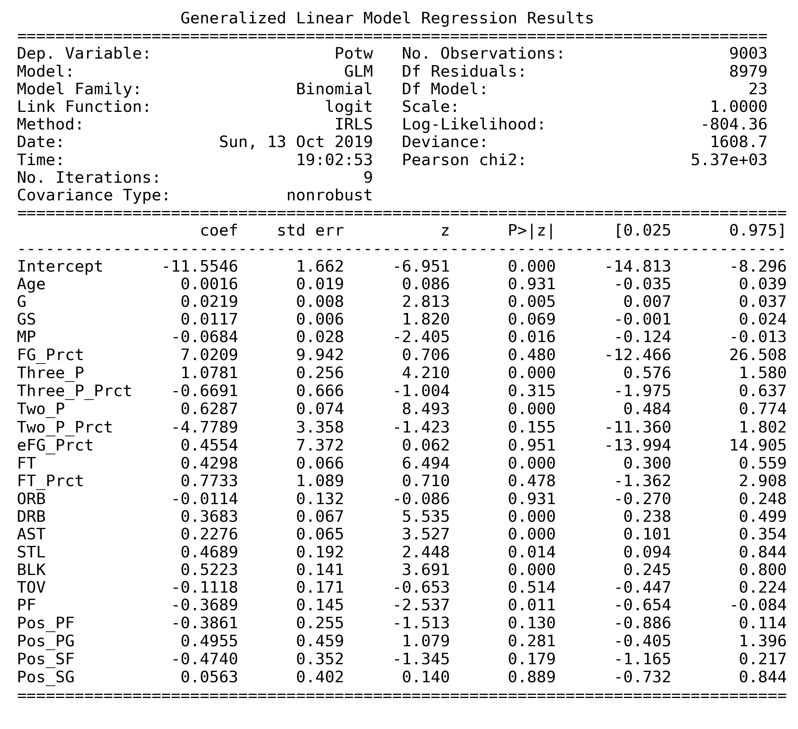
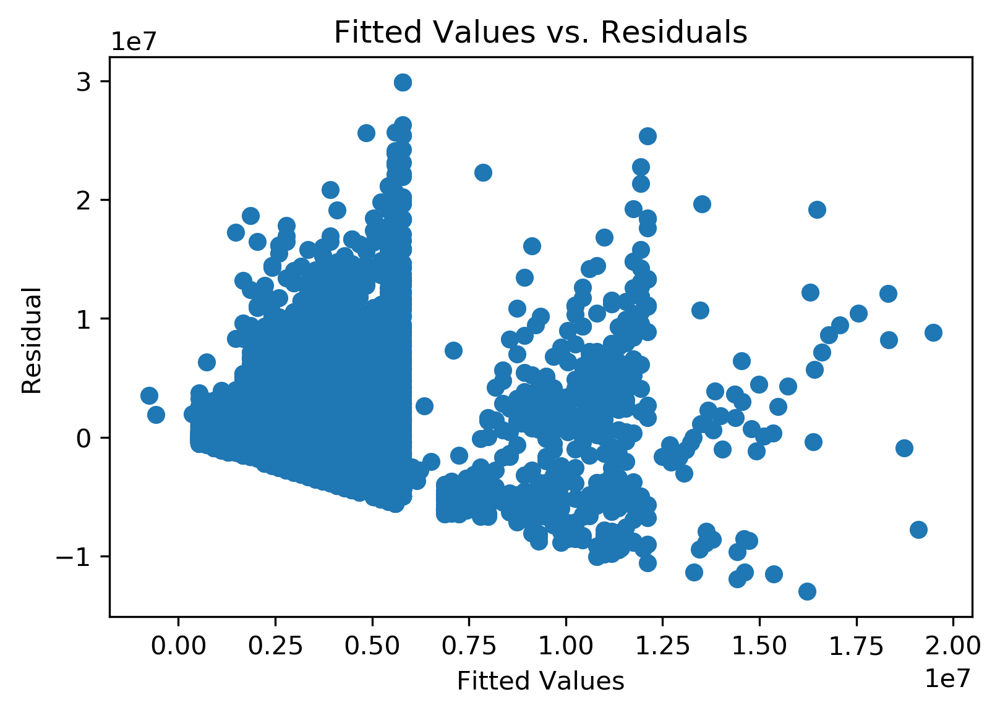
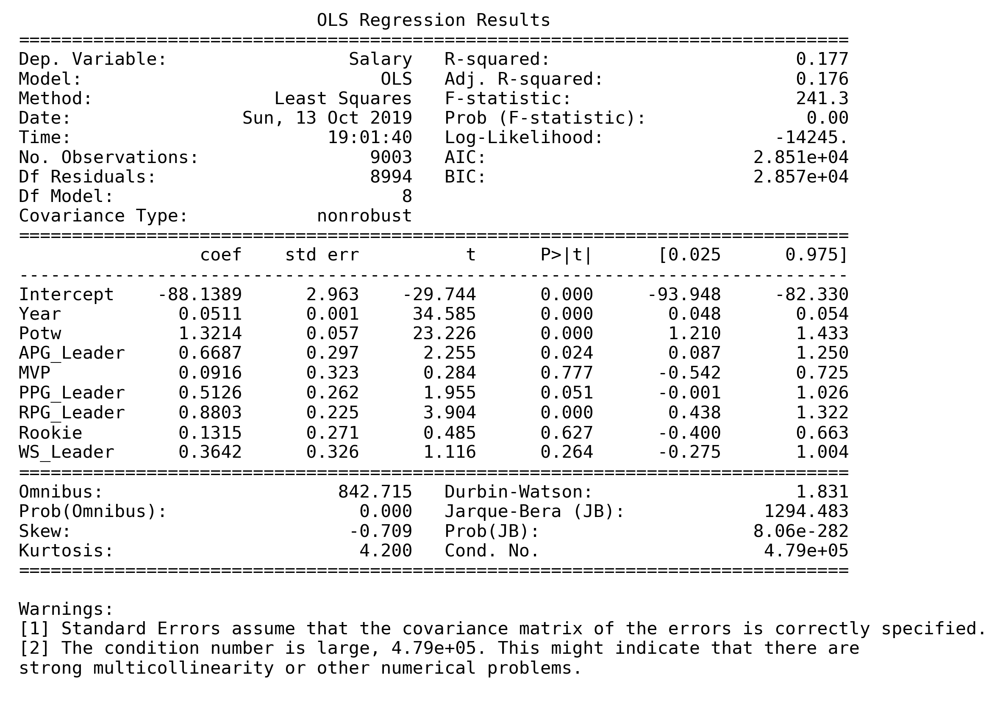

## USF MSDS 601: Linear Regression Analysis
Project: NBA Player of the Week

###### Team Members
* Shirley Li ([@Shirleyiscool](https://github.com/Shirleyiscool))
* Charles Siu ([@chunheisiu](https://github.com/chunheisiu))

### Description of Dataset
Our dataset is a combination of the following datasets with regards to NBA:

- NBA Player of the Week (1985 - 2019) 
https://www.kaggle.com/jacobbaruch/nba-player-of-the-week 
1,187 Rows, 14 Columns

- NBA Player Salary from basketball-reference.com (1991 - 2017) 
https://www.kaggle.com/whitefero/nba-player-salary-19902017 
11,837 Rows, 7 Columns

- NBA Player Salary from basketball-reference.com (2018 - 2019) 
https://web.archive.org/web/20181002194236/www.basketball-reference.com/contracts/players.html 
578 Rows, 11 Columns

- NBA Player Statistics (1985 - 2019) 
https://www.basketball-reference.com/leagues/ 
18,480 Rows, 30 Columns

- NBA Yearly Summary (1985 - 2019) 
https://www.basketball-reference.com/leagues/ 
35 Rows, 8 Columns

Combining the aforementioned datasets, we created a dataset in which, each row is an NBA player per season, and each column is a statistic of the player. We filtered the rows so that only the players who have both statistics and salary data for that particular season are included.

There are 9,003 Rows and 38 Columns in the dataset.

#### Index of the Dataset
| Variable | Definition | Type |
|---|---|---|
| `Year` | (e.g. `1991` means the NBA 1990 - 1991 Season) | Numerical |
| `Player` | Player name | Categorical |

#### Variables of the Dataset
| Variable | Definition | Type |
|---|---|---|
| `Pos` | Player Position | Categorical |
| `Age` | Age of Player at the start of February 1st of that season | Numerical |
| `Tm` | Team of Player | Categorical |
| `G` | Number of games played | Numerical |
| `GS` | Number of games played when the game started | Numerical |
| `MP` | Minutes played per game | Numerical |
| `FG` | Field Goals per game | Numerical |
| `FGA` | Field Goal attempts per game | Numerical |
| `FG_Prct` | Field Goal percentage | Numerical |
| `Three_P` | 3-Point Field Goals per game | Numerical |
| `Three_PA` | 3-Point Field Goal attempts per game | Numerical |
| `Three_P_Prct` | 3-Point Field Goal percentage | Numerical |
| `Two_P` | 2-Point Field Goals per game | Numerical |
| `Two_PA` | 2-Point Field Goal attempts per game | Numerical |
| `Two_P_Prct` | 2-Point Field Goal percentage | Numerical |
| `ePF_Prct` | Effective Field Goal percentage _This statistic adjusts for the fact that a 3-point field goal is worth one more point than a 2-point field goal._ | Numerical |
| `FT` | Free Throws per game | Numerical |
| `FTA` | Free Throw attempts per game | Numerical |
| `FTA_Prct` | Free Throw percentage | Numerical |
| `ORB` | Offensive Rebounds per game | Numerical |
| `DRB` | Defensive Rebounds per game | Numerical |
| `TRB` | Total Rebounds per game | Numerical |
| `AST` | Assists per game | Numerical |
| `STL` | Steals per game | Numerical |
| `BLK` | Blocks per game | Numerical |
| `TOV` | Turnovers per game | Numerical |
| `PF` | Personal Fouls per game | Numerical |
| `PTS` | Points per game | Numerical |
| `Potw` | Was the player named _Player of the Week_ during the season? | Binary |
| `APG_Leader` | Was the player named _Assists Per Game Leader_ during the season? | Binary |
| `MVP` | Was the player named _Most Valuable Player_ during the season? | Binary |
| `PPG_Leader` | Was the player named _Points Per Game Leader_ during the season? | Binary |
| `RPG_Leader` | Was the player named _Rebounds Per Game Leader_ during the season? | Binary |
| `Rookie` | Was the player named _Rookie of the Year_ during the season? | Binary |
| `WS Leader` | Was the player named _Win Shares Leader_ during the season? | Binary |
| `Salary` | Player Salary | Numerical |

### Statement of Research Problems and Methods
Using the dataset, we stemmed two main research problems:
- **What player statistic contributes the most to the event that the player is named Player of the Week?** 
Since whether a player is named Player of the Week is a binary variable, we decided to approach this problem using the logistic regression model.

- **What NBA title, including Player of the Week, has the most weight on the salary of the player?** 
Since the salary of a player is a numerical variable, we decided to approach this problem using the multiple linear regression model.

For both problems, model selection was performed to find the optimal model, and model diagnosis was performed to mitigate the possible issues of heteroscedasticity, multicollinearity and autocorrelation.

### Problem 1: Relationship between Player Statistics and Player of the Week

#### Explanatory Analysis

After extracting the relevant player statistics and Player of the Week from the dataset, we plotted the relationship between the statistics and Player of the Week using a scatter plot.

Observing the scatter plot, since `Potw` is a binary variable, the scatter plot did not give us a lot of useful information, apart from the differences in range of statistic values between the `Potw = 0` and `Potw = 1`. For every statistic, the range of values seems to be smaller for `Potw = 1`, with the most significant variable being `eFG_Prct`.

This discrepancy in range is also evident in the difference in frequency between `Potw = 0` and `Potw = 1`.

|   Potw |   Count |      Prct |
|-------:|--------:|:---------:|
|      0 |    8505 | 0.944685  |
|      1 |     498 | 0.0553149 |

The frequency table shows that `Potw = 0` accounts for 94% of the data, which is to be expected since the number of players receiving an award would always be significantly smaller than those who did not. However, we are not sure if this would effect the reliability of the models we would build in regression analysis.

We also plotted the correlation using a heatmap.

Observing the heatmap, there are evidence that multicollinearity might exist. For example, The most correlated variables are `Two_P_Prct` and `FG_Prct`, but this is to be expected since `FG_Prct` is derived from `Two_P_Prct`. Similarly, `eFG_Prct` is derived from `FG_Prct`, so the correlation is high between them. Hence, some of these variables, specifically those that have direct relationships, will need to be removed prior to regression analysis.

Meanwhile, `TOV`, `AST` and `STL` are highly correlated between one another. However, turnovers, assists and steals are basketball moves often performed by point guards, so there might be indirect relationships between these variables. Nonetheless, these correlations would need to be addressed in regression analysis.

#### Regression Analysis

As `Pos` is categorical variables, we first get dummies for this predictors and fit the full model using all the other players' statistics, such as `Age`,`G`,`GS`,`MP`,`FG` and etc.. Hence, we got the following logistic regression model as follows.

##### Full Model Summary

Given that there are too many variables with high correlation from the heatmap above as well as the there is warnning on multicollinearity, we decided to first use vif to remove variables with max vif values until all the remaining predictors with vif values less than 10.

##### Vif analysis on full model

|   VIF Factor | Features     |
|-------------:|:------------:|
|     26.0211  | Age          |
|     11.3482  | G            |
|      6.7615  | GS           |
|     83.4158  | MP           |
|  17012       | FG           |
|  34424.3     | FGA          |
|    954.273   | FG_Prct      |
|    686.854   | Three_P      |
|   2536.17    | Three_PA     |
|      6.35287 | Three_P_Prct |
|   6836.73    | Two_P        |
|  22445.9     | Two_PA       |
|    169.023   | Two_P_Prct   |
|    785.512   | eFG_Prct     |
|    979.946   | FT           |
|    128.659   | FTA          |
|     25.7676  | FT_Prct      |
|     11.9941  | ORB          |
|     18.7982  | DRB          |
|     12.4838  | AST          |
|     10.2294  | STL          |
|      3.98979 | BLK          |
|     25.5512  | TOV          |
|     20.8393  | PF           |
|  21427.7     | PTS          |
|      2.34968 | Pos_PF       |
|      4.97383 | Pos_PG       |
|      3.15486 | Pos_SF       |
|      4.05631 | Pos_SG       |

Using a function to remove variables with max vif for every vif analysis, we got these remaining predictors with small vif values finally.

|   VIF Factor | features     |
|-------------:|:------------:|
|      7.95085 | G            |
|      4.94142 | GS           |
|      3.43524 | Three_P      |
|      4.71419 | Three_P_Prct |
|      5.18055 | FT           |
|      6.44495 | ORB          |
|      8.28762 | AST          |
|      9.34177 | STL          |
|      3.26413 | BLK          |
|      1.82872 | Pos_PF       |
|      3.3308  | Pos_PG       |
|      2.08894 | Pos_SF       |
|      2.45765 | Pos_SG       |

So, with these predictors, we then do the reduced model regression. The result is as follows.

##### Reduced Model Summary

To make sure whether reduced model is better than the full model, we do a deviance test.

Null Hypothesis: Reduced model

ΔG = ΔG(Reduced Model) - ΔG(Full Model) = 1797 - 1592 = 205

On significat level of 0.05, ΔG > \chi^2. Therefore, we should reject

### Problem 2: Relationship between NBA Titles and Player Salary

#### Explanatory Analysis

After extracting the relevant player titles and salary from the dataset, we plotted the relationship between the titles and salary using a scatter plot.

Observing the scatter plot, since all of the variables are binary except for `Year`, it is difficult to interpret the relationships using the scatter plot. Looking at the `Year` plot, there is evidently a positive linear relationship between `Year` and `Salary`. What is also interesting about the `Year` graph is that, despite having a positive relationship, the range of values also increased for every season.

This change in range may have been affected by the increase in observations over the years.

|   Decade |   Count |
|---------:|:-------:|
|     1990 |    2416 |
|     2000 |    2998 |
|     2010 |    3589 |

From the frequency table, we can clearly see the increase in observations over the seasons. The cause of this is unknown; either there is a steady increase in players, or there is a steady increase in data collected. Nonetheless, this might be worth looking into and be cautious about during regression analysis.

We also plotted the correlation using a heatmap.

Observing the heatmap, the overall correlation seems pretty low, except for `WS_Leader` and `MVP`. This means that, except for MVP and Win Shares Leader, having one NBA title does not automatically entitled you to another. It also meant that multicollinearity is likely not an issue in regression analysis.

#### Regression Analysis

We first fitted the full model with variables `Year`, `Potw`, `APG_Leader`, `MVP`, `PPG_Leader`, `RPG_Leader`, `Rookie`, `WS_Leader`.

##### Model Summary

##### ANOVA Table
| index      |   df |      sum_sq |     mean_sq |          F |         PR(>F) |
|:-----------|-----:|------------:|------------:|-----------:|:--------------:|
| Year       |    1 | 2.3164e+16  | 2.3164e+16  | 1330.82    |   7.34954e-272 |
| Potw       |    1 | 2.21228e+16 | 2.21228e+16 | 1271       |   1.67026e-260 |
| APG_Leader |    1 | 2.89658e+14 | 2.89658e+14 |   16.6414  |   4.55432e-05  |
| MVP        |    1 | 3.69627e+14 | 3.69627e+14 |   21.2359  |   4.11687e-06  |
| PPG_Leader |    1 | 4.0067e+14  | 4.0067e+14  |   23.0193  |   1.6296e-06   |
| RPG_Leader |    1 | 6.31608e+14 | 6.31608e+14 |   36.2872  |   1.76961e-09  |
| Rookie     |    1 | 8.00524e+13 | 8.00524e+13 |    4.59918 |   0.032014     |
| WS_Leader  |    1 | 6.38674e+13 | 6.38674e+13 |    3.66932 |   0.0554546    |
| Residual   | 8994 | 1.56548e+17 | 1.74058e+13 |  nan       | nan            |

From the model summary and ANOVA table, it is evident that `MVP` and `WS_Leader` are not statistically significant variables based on both t-test and F-test. However, since they are highly correlated, as mentioned above, it is likely that only one of them would need to be remove.

Upon checking the linearity of the model, we found signs of non-linearity from the residual plot.

Hence, we performed a log transformation on `Salary` to attempt to correct the problem. We refitted the full model using the log-transformed data.

##### Model Summary

##### ANOVA Table
| index      |   df |       sum_sq |     mean_sq |           F |         PR(>F) |
|:-----------|-----:|-------------:|------------:|------------:|:--------------:|
| Year       |    1 |  1709.68     | 1709.68     | 1231.95     |   4.70618e-253 |
| Potw       |    1 |   926.665    |  926.665    |  667.731    |   4.35078e-142 |
| APG_Leader |    1 |     6.77177  |    6.77177  |    4.87956  |   0.0272016    |
| MVP        |    1 |     5.36321  |    5.36321  |    3.86459  |   0.0493459    |
| PPG_Leader |    1 |     6.68263  |    6.68263  |    4.81533  |   0.0282331    |
| RPG_Leader |    1 |    22.0516   |   22.0516   |   15.8898   |   6.76709e-05  |
| Rookie     |    1 |     0.323805 |    0.323805 |    0.233326 |   0.629081     |
| WS_Leader  |    1 |     1.72901  |    1.72901  |    1.24588  |   0.26437      |
| Residual   | 8994 | 12481.7      |    1.38778  |  nan        | nan            |

From the model summary, the log-transformed data confirmed the statistical insignificance of `MVP`. Meanwhile, the ANOVA table shows that `Rookie` and `WS_Leader` are also statistically insignificant. We kept that in mind for model selection.

The log-transformed data had seemingly reduced the severity of non-linearity.
